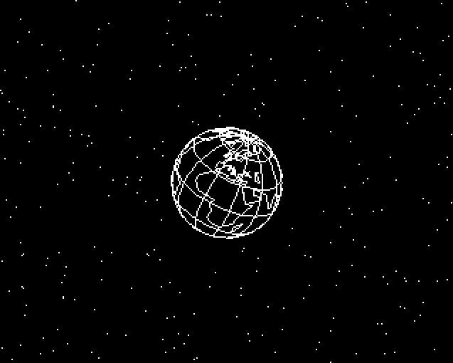
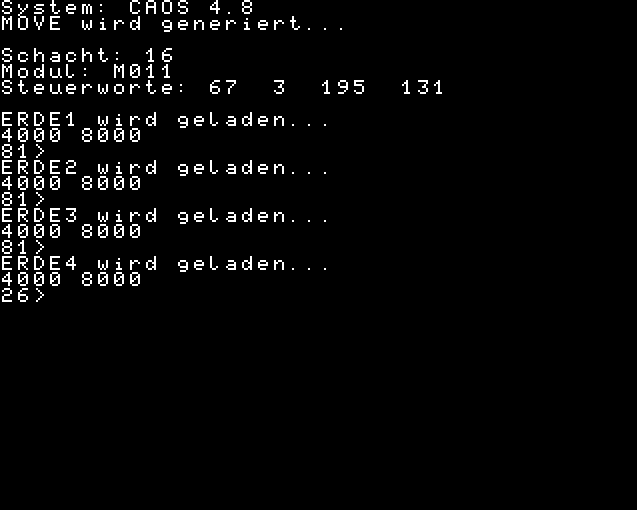

# KC85.5_GLOBSHOW
GLOBSHOW für den KC85/5 mit CAOS 4.7 (oder neuer)

## Nutzung
GLOB2024.SSS und die ERDE\*.DAT-Dateien auf einen USB-Stick kopieren.
Im BASIC des KC85/5 das Programm laden: CLOAD"GLOB2024"
und starten: RUN

Die Geschwindigkeit der Animation kann mit den Cursortasten (links/rechts) gesteuert werden.

Das Original ist hier zu finden [^1].
Angepasst und erweitert für den KC85/5.

Neu: automatische Modulsuche nach RAM-Modulen [^2]: 
- M011 (64k)
- M032 (64k)
- M036 (128k)
- M032 (256k)
- M034 (512k)

Es werden nur RAM-Module unterstützten, die mindestens 64k Speicher mitbringen und die sich auf Adresse 4000h einblenden lassen.

## Referenzen und Links
[^1]: https://www.iee.et.tu-dresden.de/~kc-club/09/RUBRIK09.HTM  

[^2]: http://www.mpm-kc85.de/html/ModulListe.htm  

[^3]: [PASMO, Z80 cross assembler](https://pasmo.speccy.org/)  
